超级电容控制板Plus
====

# 碎碎念

在2024年开源的Lite版本超级电容控制板中，由于缺乏硬件保护电路设计的理念（也有一部分原因是调试的时候没炸过板子带来的自信），认为软件保护足以应对所有问题。在24赛季与南航（我们采用的是相同的拓扑，可惜他们没开源）交流以及后来莫名其妙出现炸板现象的时候，就越发觉得必须存在硬件保护作为最后的保险。

# 新特性

本篇仅讲述PLUS新增部分的内容，其余内容与LITE相差无几。

## 远端补偿

此版本加入远端补偿，主要是为了能够尽量减少线损引起的与裁判系统电压采样的误差而导致的功率误差。

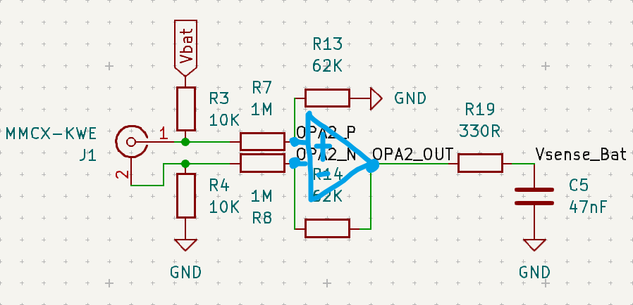

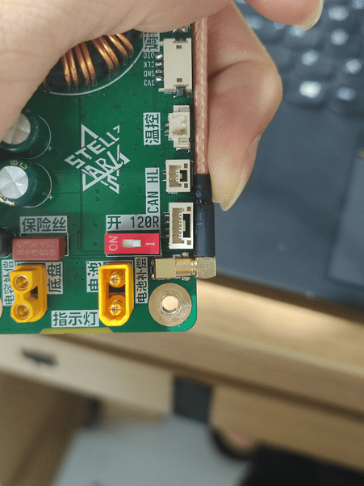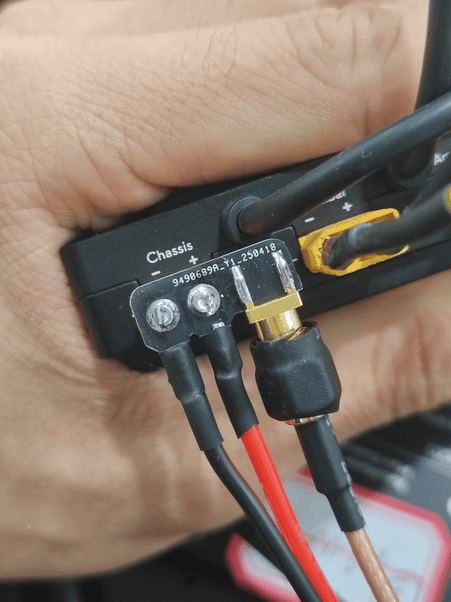

> 由于使用的是STM32G4内部的运算放大器，蓝色的线条是我画上去方便观看的。

上图是远端补偿的电路图，BAT网络是超级电容控制板的电池端口，MMCX-KWE是远端补偿端口。使用MMCX-KWE进行远端补偿的采样线，搭配MMCX转SMA同轴线，以及“电源管理模块Chassis采样小板”可以实现远端电压补偿。

MMCX的外壳以及SMA的外壳不属于GND，不能与任何金属进行接触，否则会导致远端采样产生误差，若不使用远端补偿则悬空即可。

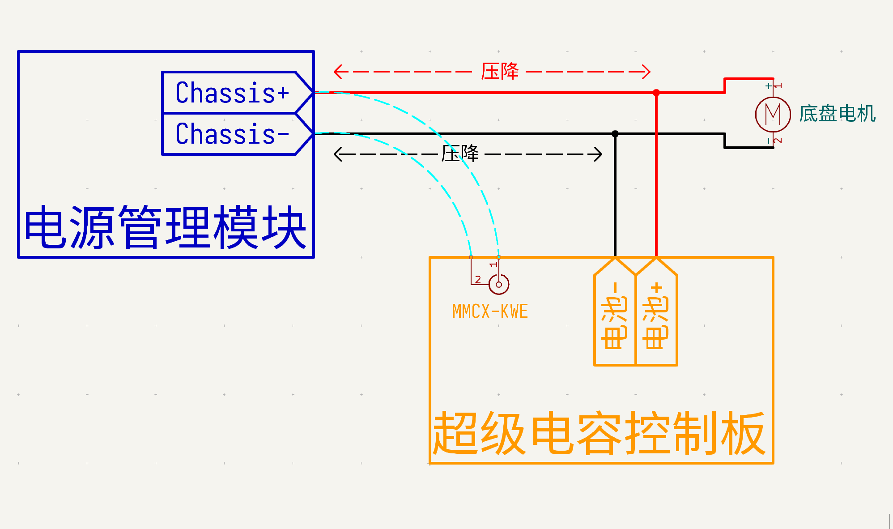

当导线经过电流时会产生压降：Vdrop = I * R，远端补偿线连接于电源管理模块Chassis最开始的输出端，而控制板上的电池端口需要经过导线进行连接，所以BAT（电池端口）的电压由于导线压降而导致其电压小于MMCX（电源管理模块Chassis端口）的电压。在图中，MMCX相对于BAT更接近运算放大器输入端，并且两者之间串联了一个较大的电阻，因为电流方向从Chassis端口流向底盘电机（动能回收忽略不计），所以只要导线存在线损压降，MMCX两端的电压都会比BAT两端电压大，全差分运算放大器的输出则是以MMCX两端的电压进行差值、衰减后输出，从而保证采样的电压为Chassis端口的电压。

因为电源管理模块进行底盘功率计算的时候，其电压采样点在电源管理模块内部，当超级电容控制板进行远端补偿采样，将电压采样点移到Chassis端口上可以尽量减少采样电压与裁判系统的误差，使得超级电容控制板对Chassis端口功率检测与裁判系统对Chassis端口的功率检测保持一致，从而减少采样误差对功率控制的影响。

必须使用全差分放大器才能保证远端补偿能够输出正确的电压，若不采用全差分放大器，则采集出来的电压是以板子GND进行做差输出，由于导线正负极均会产生线损，以板子的GND做差进行输出会导致其无法补偿负极导线的线损，产生采样误差。

在超级电容控制板Plus使用四位半万用表进行拟合校准后，认为其绝对精度已经足够精准，但是在赛场上，需要以裁判系统的数值作为参考，其相对精度仍不确定。这一点只能相信裁判系统在出厂的时候进行了相应的较准，保证自身绝对精度能够保持一致。（不然不同的电源管理模块读出的功率不一样，这就有点不公平了）

经过测试，加入线损补偿之后，电源管理模块chassis接口到超级电容控制板之间使用约50cm的18AWG硅胶线进行连接，在24V，0-10A负载的范围内，超级电容控制板Plus的功率检测数值与裁判系统显示的数值误差在±1W；去掉线损补偿后，误差达到了-5W。

**检测功率偏小会带来什么影响呢？**

我队2025赛季使用的功率控制算法基于西交利物浦的电机功率模型，使用超级电容控制板回读功率进行校正，保证100%按照设定功率运行，同时减少对裁判系统的依赖。

那如果，超级电容控制板回读的功率偏小，比如小了5W，在功率限制100W的情况下，我设定底盘跑100W，实际确实跑了100W，但是超级电容控制板回读95W，代码会认为他没达到指定功率，从而增加一点功率达到105W，此时就会小幅度超功率了，确实此时可以再根据缓冲能量的阈值来减小功率，但是如果，以后缓冲能量减小到10J呢？或者你的底盘代码在某些特定情况下超调了呢？

关于某些特定情况下超调，我队在纯使用缓冲能量闭环的时候，在机器人全功率行驶过程中如果猛转头，就会造成缓冲能量耗尽导致底盘断电。（我不是电控，我只知道存在这个现象）

倒是可以通过减少使用功率来实现不超功率，但是不同机器人走线长度不同，线有长有短，会造成功率补偿较为麻烦，如果减的太多就得不偿失了。所以加上远端补偿，可以从根本去解决这个问题，剩下的就是参考源不同造成的检测精度误差了。

## 下管电流采样

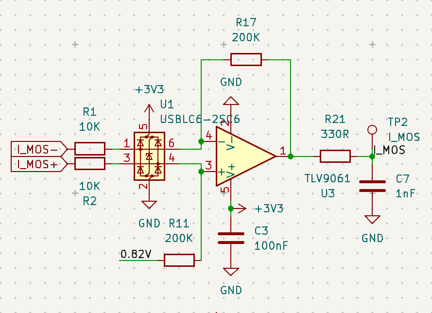

下管电流采样使用全差分放大器进行电流采样放大，增益为20V/A，搭配2mR的检流电阻，在2.5V参考电压、0.82V偏置电压下，可以实现-20A与+40A的量程，负量程为充电电流，正量程为放电电流。总量程60A的电流在12位ADC下的最小分辨率为60 / 2^12 = 0.015A，但是实际上12位的ADC不可能完全精确地采到最小的分辨率。在手册中，不同条件下STM32G431的ADC在最高采样率下的有效分辨率（ENOB）在10 \~ 11位之间，最小分辨率则是在0.03 \~ 0.06A之间，考虑到各种噪声之类的影响，可信的准确最小分辨率大概还需要砍半，也就是0.1A的电流分辨率应该是较为合理的。

或许有人想通过超采样后进行滤波来降低噪声以提高ADC的有效分辨率，但是这会增加CPU的计算量，并且引入额外的采样延迟，这可能会影响到环路带宽，具体我也不清楚，不过0.1A的有效电流分辨率对于我来说已经是足够了。

> 作者目前没有足够的能力去测试这个电流分辨率以及电流精度的参数，这个分析是从[《五位半万用表硬件设计》](https://forum.anfulai.cn/forum.php?mod=viewthread&tid=99254&extra=page%3D1)的文章中学来的。
> 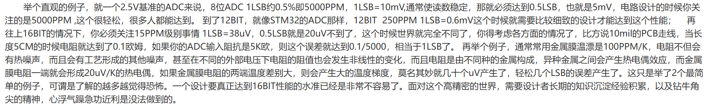

在Lite版本中，电容电流采样使用INA181进行采样，虽然其28V耐压对于电容组21V来说存在较大的冗余，但是可能是上电尖峰，或者是热拔插的浪涌，还是偶尔会导致INA181烧毁（所以这个版本把他删了）。

在Lite版本中，INA181烧毁的情况下，其实他还是可以通过改一下代码来运行（可行，但是没实装），因为这样无法检测出底盘运行的真实功率，从而导致开启超级电容的时候无法精确控制底盘的消耗功率。

使用下管续流采样，第一个好处是更低的成本，第二个好处是没有共模电压的担忧。缺点嘛：在下管开通时间过短的时候，会产生较大的误差，在下管10%占空比下，10A负载会引起2A的误差（0A误差0.2A左右）。下管占空比小只会出现在压降很小的情况下，搭配21V电容组，下管占空比10%的时候需要输入电压23.3V，电池在大部分时间都超过这个电压，所以其实可以很大程度上忽略这个问题。

另外还有一个原因，就是这个下管电流检测，其实只是对超级电容充放电支路的功率检测与限流保护，与【电池端口】输入功率进行运算得到底盘运行功率，只要保证【电池端口】的功率检测准确即可避免底盘功率超限。

关于全差分低边电流采样的设计，请参考德州仪器的《高速低侧电流检测参考设计》

## 硬件保护

新增的硬件保护主要是模拟引脚的电源浪涌保护、ESD防护，保险丝，PMOS与PWM的时序延迟保护。

### 电源浪涌保护

【电池端口】与【电容端口】电源输入端口均添加了SMC封装的TVS，可以一定程度上避免热拔插产生的尖峰电压。

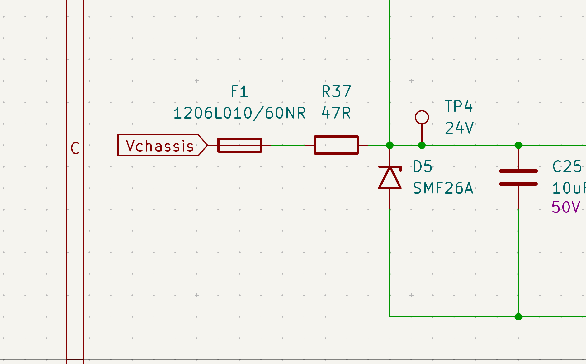

这里是辅助电源上的电源浪涌保护，主要是自恢复保险丝串联限流电阻+小功率TVS。虽然电源输入端口的TVS与大电容可以一定程度上削减尖峰电压的危害，但是在与群友的探讨中得知，MLCC过低的阻抗会在上电瞬间产生较大的浪涌电流，似乎会导致一些设计较差的DCDC芯片烧毁。为了避免此类现象的发生，故在辅助电源之前添加限流电阻与额外的小功率TVS进行进一步保护。

R37的电阻看着虽然很大，但是实际上，辅助电源、以及所有后级电路的功耗并不会很大，在R37上通过250ma时会产生11.75V的压降，此时可为后级提供(Vbat - 11.75) x 0.25 ≈ 3 W的功率，这已经非常足够了。并且，自恢复保险丝额定电流选的是100ma的，熔断电流为250ma，所以R37并不会影响电路的正常运行。

### ESD防护

在Lite版本中，INA181的REF引脚与STM32G431的OPA1_OUT引脚直连，其需要承受较大的共模电压，已经发现有烧毁OPA1_OUT引脚的现象发生。故为了避免此类现象的发生，在与功率线路直接或间接连接的引脚均增加esd进行防护。

### 保险丝

**请勿因为保险丝频繁熔断而擅自更换更大的保险丝，超出设计参数的保险丝并不一定能起到保护作用。若保险丝熔断，但是板子没有出现其他故障，则说明你的使用环境超出了本设计的极限，请考虑去使用其他的开源项目。**

在联盟赛比赛前夕，Lite版本突发集体炸管（好在比赛全程无异常状况），可能跟代码更新，改动了pwm与pmos的开关时序有关（V1.1.2517版本代码已进行时序控制，保证其正确运行）。这引出了一个问题：超级电容模组失效保护。详见：通用型超级电容模组短路保护板-RoboMaster 社区

外接模块只是亡羊补牢，应该在设计之初就进行考虑，故Plus加入保险丝只是顺手的事。

**为何选择5A慢断？**

1、他是插件封装，熔断后的拆焊与更换较为方便，你也可以选择10A快断保险（封装焊盘进行了扩大，可兼容1808贴片快断保险丝），但不建议使用保险座，多次更换保险后可能会出现松动的现象。

2、其熔断曲线相对于快断保险，更符合裁判系统的保护曲线。即使超级电容模组以10A（240W）进行放电，其持续时间也不会超过10秒，并不会使得保险丝熔断。而240W已经是额定功率的两倍了，再高的功率，受限于规则限制与超级电容的物理限制，已经没有太明显的收益了。在保证正常运行的情况下，使用更低熔断电流的保险丝能够在出现爆炸💥的时候更快先于裁判系统的保护进行熔断，避免“通道0超载”的现象发生。

## 保险丝熔断检测

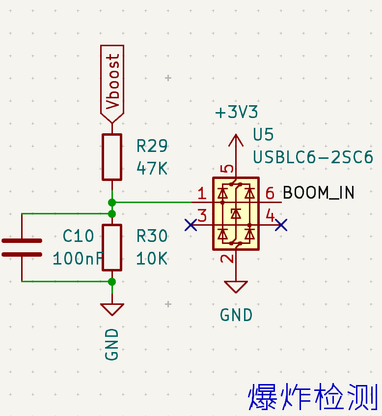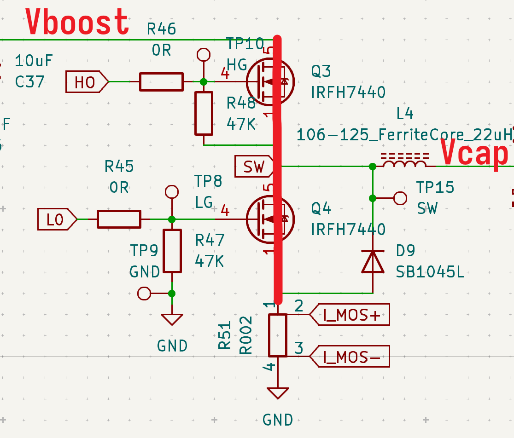

保险丝熔断检测的原理是检测保险丝两侧的电压差。Vboost通过保险丝与【电池端口】相连接，在本项目中，导致保险丝熔断的最大原因是半桥MOS烧毁，这通常会导致半桥直接对地短路，短路产生的短路电流会使得保险丝熔断，那么此时Vboost与Vcap均会被接地，电压为0。然后BOOM_IN引脚的电压也会变成0，从而触发保险丝熔断保护。

通常情况下，Vboost被电阻分压，STM32的引脚输入 > 0.7VDD时为高电平，3.3V供电下大约为2.3V，所以Vboost在大概13V以上时，BOOM_IN为高电平，不会触发短路保护。13V是超级电容控制板运行的最低极限电压，低于此电压栅极驱动将无法工作，所以正常运行时，只存在保险丝熔断会导致Vboost低于13V，不用担心误触发。

## PMOS与PWM的时序延迟保护

在SuperCapCtrl-V1.1.2517版本代码加入的软件时序控制与此功能相同，但是我更相信硬件实现的可靠性，所以使用逻辑门搭建了一个硬件延迟电路。

其主要目的是保证PWM与PMOS的开关状态稳定可控，当控制板运行于Buck（充电）状态时，PMOS导通与否都不会对运行产生太大的影响（但是电流会通过PMOS的体二极管产生较大的损耗）。出现问题的地方在Boost（放电状态），当处于Boost状态，但PMOS没有导通时，由于”电感电流不能突变“，电流需要经过PMOS向底盘流动，但是PMOS处于关断状态，此时电流无处可去，则会在PMOS前面产生一个电压尖峰，这个电流尖峰有可能会导致PMOS与半桥MOS击穿。

所以为了控制PMOS永远在输出PWM之前导通，而先于PWM停止之前关断，故使用与门、或门搭建一个延迟电路。其输入为ENABLE信号，输出分别控制定时器的BREAK信号与PMOS栅极。

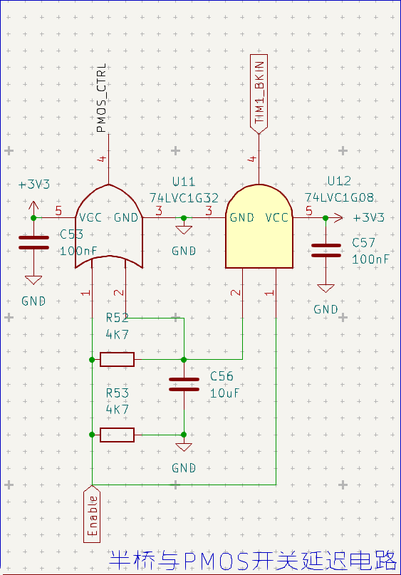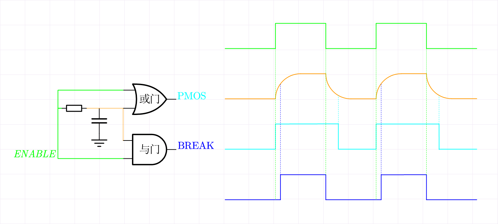

BREAK与定时器输出信号的关系为：

- BREAK高电平-定时器输出PWM
- BREAK低电平-定时器不输出PWM

当ENABLE从低电平变为高电平时，或门的一个输入为高电平，所以或门输出变为高电平，PMOS由关断变为导通，此时与门输入只有一个高电平，所以与门保持低电平输出，定时器保持不输出PWM；随着ENABLE的高电平信号持续给电容充电，当电容上的电压上升到高电平电压阈值时，此时与门得到两个高电平信号输入，输出高电平，定时器变为输出PWM。

当ENABLE从高电平变为低电平时，由于电容存在电压，或门的一个输入为高电平，所以或门保持高电平输出，PMOS保持导通，而与门输入只有一个高电平，所以与门输出变为低电平，定时器变为不输出PWM；随着ENABLE的低电平信号持续给电容放电，当电容上的电压下降到低电平电压阈值时，此时或门输入信号均为低电平，所以或门输出低电平，PMOS由导通变为关断。

左右两边延迟时间并不一定是对称的，具体由逻辑门的高低电平信号阈值决定。

## 全新的充放电环路逻辑

在SuperCapCtrl库V1.1的代码中，为了能够让电控对超级电容模组进行更自由的充电、放电与使用功率的控制，使用了较多的标志位与单独的充放电循环函数，这使得电控需要对超级电容模组的运行有较为清晰的理解，使用起来不够简便。

为了解决这一问题，SuperCapCtrl库的更新到V1.2，并且基于西交利物浦的电机功率模型控制思路为电控编写了一个机器人底盘功率库进行搭配食用，控制指令仅保留【使能】标志位，和必要的【功率上限】数值。超级电容模组在使能的时候会根据底盘运行功率实时自动进行功率补偿，电控仅需手动使“底盘功率超限”即可激活超级电容模组。

具体的使用方式请参考【RM2025超级电容控制板PLUS & SuperCapCtrl_V1.2 使用手册】桂林理工大学-群星战队-RoboMaster 社区

# 机械装配

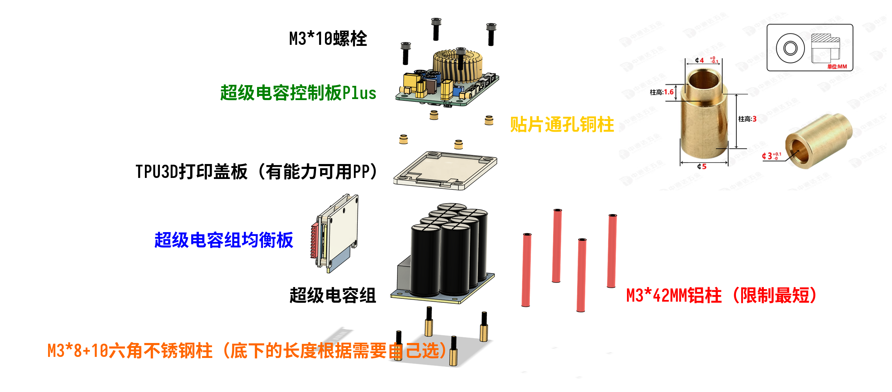

PLUS的体积由LITE的40 x 60 x 20mm提高到了 45 x 75 x 20mm，面积与孔位与电容组一致，可直接与电容组进行堆叠（原先的LITE只想着机制的体积，忘记了机械装配的合理性），由于只是将面积扩大到了与电容组一致的面积，所以在装配上并没有变化，仍可以直接装到装甲板后。

3D打印盖板仅用于遮盖底部的电子元器件，正常情况下，TPU的耐温足够应对超级电容模块的温升。

# 物料更替

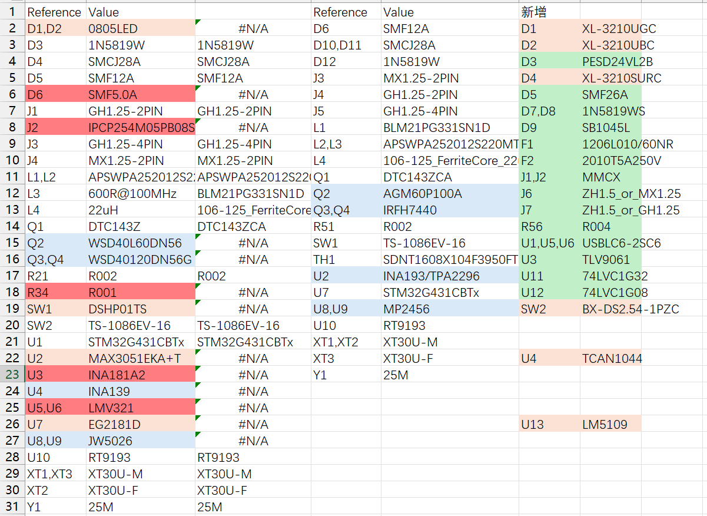

左侧为Lite版本主要元器件，右侧为Plus版本主要元器件。

红色完全删除

橙色为右侧替换左侧（左侧删除）

绿色为全新加入

蓝色为可选替换

现在导出的BOM已经添加了立创商城的编号，可以直接匹配BOM一键下单，建议一次购买10套用量，才能有较为实惠的价格（90元/套，2025年5月）。

如果芯片全部到优信电子进行购买，成本可降低20元/套左右。

**MP2456请务必到优信购买，立创价格是优信的数倍！！！（不知道为什么，立创上的MPS芯片都特别贵）**

为了焊接友好，TCAN1044，SOT23-8封装的价格较为昂贵，有能力可以自行更换TJA1044，DFN3 * 3版本的CAN收发器，价格实惠。

**磁环电感我未添加到BOM导出列表中，因为立创商城没得买，只能去淘宝购买。我使用的是四线1.0mm并绕的106-125磁芯磁环，绕数11匝，初始感量22uH。铜线粗细和数量影响较多的是铜损，也就是DCR，对性能的影响不明显。**

磁芯型号务必使用相同的106-125，才能保证有足够的感量和饱和电流。

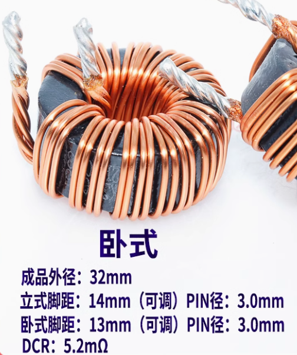

目前芯片市场价格飘忽不定，价格可能会上下浮动。

# 参考文献

高速低侧电流检测参考设计 (Rev. C)

电源远端电压补偿_远端补偿 电源电路-CSDN博客

# 特别鸣谢

感谢以下战队在Lite版本中的使用反馈（排名不分先后，想到谁就写谁）：

江南大学霞客湾校区-SHARK战队

北京理工大学珠海学院-毅恒战队

厦门大学嘉庚学院-TCR战队

宁波诺丁汉大学-AIM战队

浙江理工大学-钱塘蛟战队

# 许可证

本作品采用 [CC-BY-4.0](https://creativecommons.org/licenses/by/4.0/legalcode) 许可协议进行授权，欢迎转载，但请务必保留作者署名。