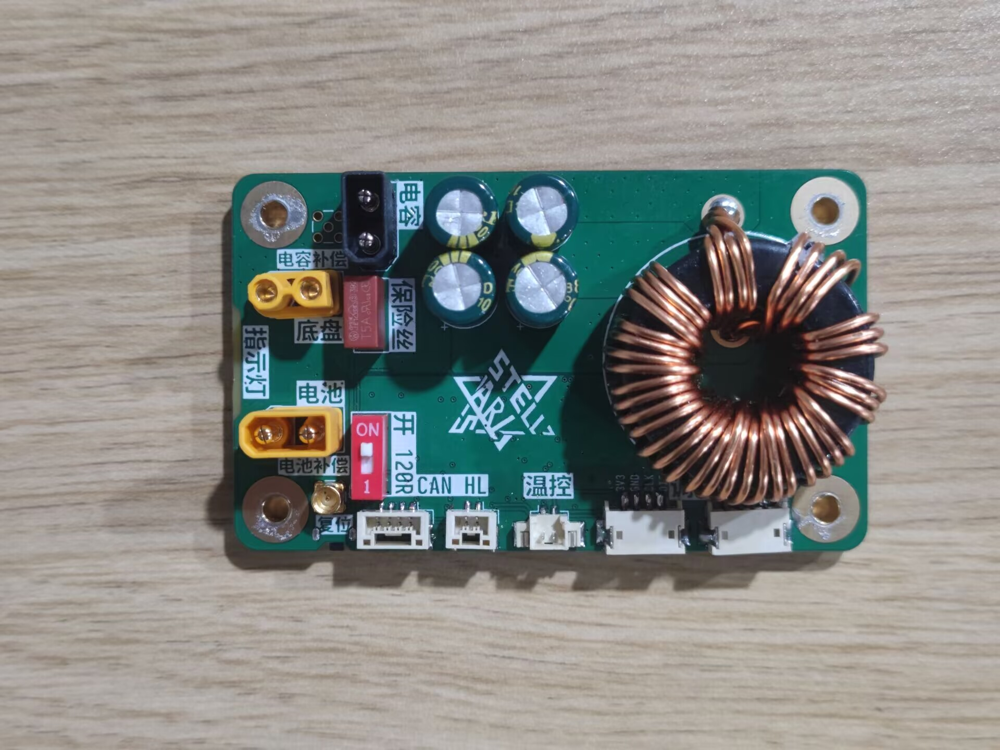
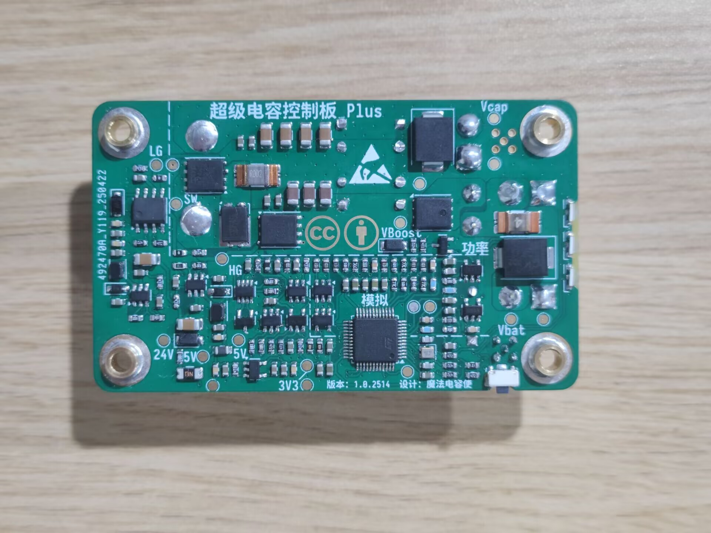

# 超级电容控制板 Plus

> 桂林理工大学 · 群星战队 · RoboMaster 2025 赛季开源工程

基于 **STM32G431CB** 的单半桥双向同步 Buck-Boost 超级电容控制板，用于RobaMaster机甲大师赛2025赛季超级对抗赛。相较 2024 赛季开源的 Lite 版本，Plus 版本围绕**远端电压补偿**、**下管电流采样**与**硬件保护**三个方面进行了重点改进，并重新设计了充放电环路逻辑。

> **完整的硬件设计说明** → [RM2025 超级电容控制板 Plus「硬件篇」 · DonotFreeze 的知识库](https://donotfreeze.github.io/robomaster/supercap-controller-plus-hardware/)

<p align="center">
  
  
</p>

## 主要特性

- **远端电压补偿**：通过 MMCX-KWE 接口 + 差分放大器，把电压采样点从板端移到电源管理模块 Chassis 端口，抵消导线线损带来的功率采样误差（24V、0–10A 范围内与裁判系统误差 ≤ ±1W，未补偿时误差约 -5W）。
- **下管续流电流采样**：采用差分放大器进行下管低边采样，搭配 2mΩ 检流电阻，量程 -20A ~ +40A（充电为负、放电为正），有效电流分辨率约 0.1A，取代 Lite 版本的 INA181。节省成本的同时提高可靠性，但是在一定程度上损失了精度。
- **硬件保护**：母线电源端口带有 TVS、并在半桥拓扑支路上有一个5A慢断保险丝，可在一定程度上保证控制板烧毁而不影响母线。辅助电源有自恢复保险丝 + 限流电阻 + 小功率 TVS 的浪涌保护。功率相关引脚 ESD 防护及其熔断检测、PMOS 与 PWM 的硬件时序延迟电路。
- **单电感同步半桥**：PMOS 防倒灌 + 半桥 Buck/Boost，配合硬件/软件时序控制保证 PMOS 先于 PWM 导通、后于 PWM 关断。

## 硬件规格

| 项目 | 参数 |
| --- | --- |
| 主控 | STM32G431CBT6 |
| 拓扑 | 同步 Buck-Boost 半桥（降压充电 / 升压放电） |
| 半桥 MOS | IRFH7440 × 2 |
| 防倒灌 PMOS | AGM60P100A |
| 栅极驱动 | LM5109 |
| 母线电流采样 | 4mΩ + INA139/INA193 兼容 |
| 电流采样 | 2mΩ 分流电阻 + 差分放大器 |
| 温度采样 | 半桥温度NTC + 外接电容组NTC |
| 通信 | CAN |
| 辅助电源 | MP2456 × 2 + RT9193（3.3V） |
| 尺寸 | 45 × 75 × 20 mm（面积与孔位与电容组一致，可直接堆叠） |

## 工程结构

```text
├─ SuperCapControlBoard_Plus.kicad_pro / .kicad_sch / .kicad_pcb   # KiCad 8.0 工程（原理图 + PCB）
├─ POWER.kicad_sch                     # 功率级原理图
├─ BOM/
│  ├─ SuperCapPowerBoard_Plus.csv      # 已附立创商城编号的 BOM
│  └─ ibom.html                        # 交互式 BOM（点击可定位元件）
├─ GERBER/                             # Gerber 生产文件（Plus / PULS 版本）
├─ 模型文件/                           # 3D STEP 模型
├─ Docs/                               # 参考资料（TI《高速低侧电流检测参考设计》）
├─ Image/                              # 文档配图
└─ CHANGELOG.md                        # 版本更新日志
```

## 固件代码

本仓库为**纯硬件工程**，不包含固件源码。固件由以下两个独立仓库提供，与本硬件配套使用：

| 仓库 | 说明 |
| --- | --- |
| [**RM-CODE-SuperCapControlBoard_Plus**](https://github.com/DonotFreeze/RM-CODE-SuperCapControlBoard_Plus) | RM2025 赛季超级电容控制板 Plus 的 **CubeMX 代码初始化工程**，提供 STM32 底层外设的 CubeMX 配置 |
| [**RM-SuperCapCtrlLib**](https://github.com/DonotFreeze/RM-SuperCapCtrlLib) | 参加 RoboMaster 机甲大师赛期间开发的 **C 语言库**，可同时用于超级电容控制板 **Lite 和 Plus**，负责充放电环路控制与对外接口 |

## 物料与打样

- BOM 已附立创商城编号，可直接一键下单；建议一次性采购 10 套用量以获得较优价格（约 90 元/套，2025 年 5 月）。
- 全部芯片若在优信电子采购，成本可再降低约 20 元/套（其中 **MP2456 强烈建议到优信购买**）。
- 磁环电感立创商城无货、未列入 BOM，需自行采购 **106-125 磁环**（四线 1.0mm 并绕 11 匝，初始感量约 22µH），磁芯型号务必一致以保证感量与饱和电流。

---

## 参考文献

- 高速低侧电流检测参考设计 (Rev. C) —— 见 `Docs/《高速低侧电流检测参考设计-TI》.pdf`
- 电源远端电压补偿 / 远端补偿电源电路 —— CSDN 博客

## 特别鸣谢

感谢以下战队在 Lite 版本中的使用反馈（排名不分先后，想到谁就写谁）：

- 江南大学霞客湾校区 - SHARK 战队
- 北京理工大学珠海学院 - 毅恒战队
- 厦门大学嘉庚学院 - TCR 战队
- 宁波诺丁汉大学 - AIM 战队
- 浙江理工大学 - 钱塘蛟战队

## 许可证

本作品采用 [CC-BY-4.0](https://creativecommons.org/licenses/by/4.0/legalcode) 许可协议进行授权，欢迎转载，但请务必保留作者署名。

## 相关链接

- [RM2025 超级电容控制板 Plus「硬件篇」](https://donotfreeze.github.io/robomaster/supercap-controller-plus-hardware/)（本工程的设计说明）
- [固件代码 · RM-CODE-SuperCapControlBoard_Plus](https://github.com/DonotFreeze/RM-CODE-SuperCapControlBoard_Plus)（CubeMX 代码初始化工程）
- [固件代码 · RM-SuperCapCtrlLib](https://github.com/DonotFreeze/RM-SuperCapCtrlLib)（Lite / Plus 通用的 C 语言库）
- [RM2024 超级电容控制板 Lite「硬件篇」](https://donotfreeze.github.io/robomaster/supercap-controller-lite-hardware/)
- [RM2025 超级电容模组 Plus「使用手册」](https://donotfreeze.github.io/robomaster/supercap-module-plus-user-manual/)
- [RM24-25 超级电容控制板 Lite & Plus「CubeMX 篇」](https://donotfreeze.github.io/robomaster/supercap-controller-cubemx/)
- [RM24-25 超级电容模组 Lite & Plus「答疑篇」](https://donotfreeze.github.io/robomaster/supercap-module-faq/)
- [DonotFreeze 的知识库](https://donotfreeze.github.io/)